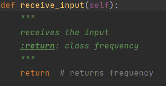
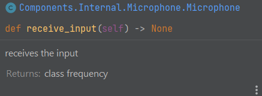

## Packages:

- Pybluez v0.30 (only for raspberry)
- Opencv-contrib-python v4.7.0.72 (headless for raspberry)
- Pylibdmtx v0.1.10
- PRi.GPIO v0.71
- pyserial v3.5
- *audio library*
- hx711 v1.1.2.3

***

## Code convention:

#### 1. Naming

- MyClass
- a_variable = 0
- a_function(self, other, a_different_value)

#### 2. Comments
- comments start with #
- add expected type to variables
- documentation comments start with """, like shown in the example below

